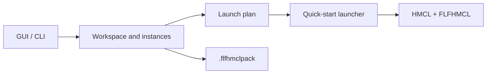

# FLFHMCLauncher Documentation

```mermaid
flowchart LR
    G["GUI / CLI"] --> W["Workspace and instances"]
    W --> L["Launch plan"]
    L --> Q["Quick-start launcher"]
    W --> P[".flfhmclpack"]
    Q --> H["HMCL + FLFHMCL"]
```

- [User guide](/en/users/flfhmlauncher)
- [Modpack authors](/en/pack-authors/flfhmlauncher)
- [Developers](/en/developers/flfhmlauncher)
