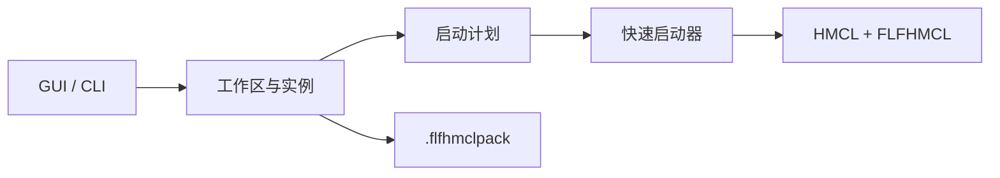

# FLFHMCLauncher 中文文档

```mermaid
flowchart LR
    G["GUI / CLI"] --> W["工作区与实例"]
    W --> L["启动计划"]
    L --> Q["快速启动器"]
    W --> P[".flfhmclpack"]
    Q --> H["HMCL + FLFHMCL"]
```

- [用户指南](/zh/users/flfhmlauncher)
- [整合包作者指南](/zh/pack-authors/flfhmlauncher)
- [开发者文档](/zh/developers/flfhmlauncher)
